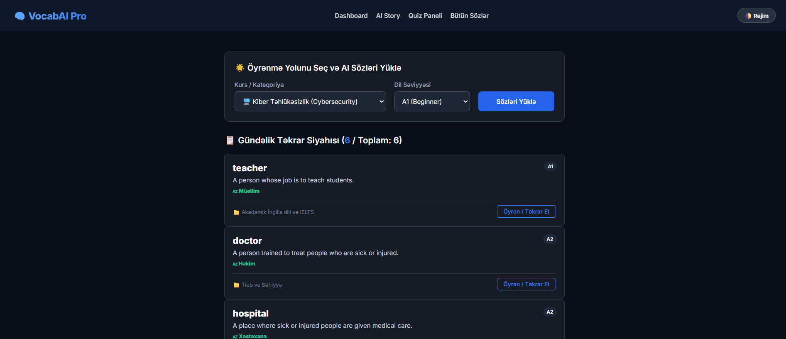
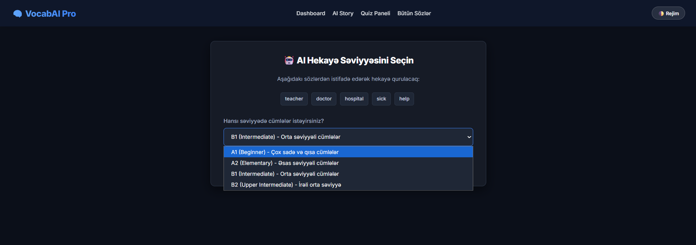
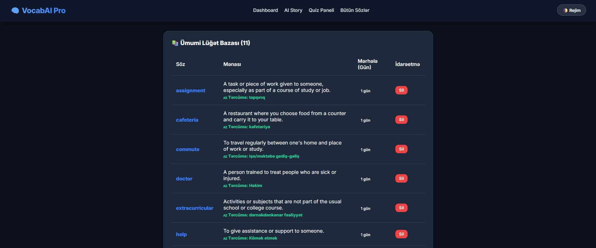

#  VocabAI-Pro

VocabAI-Pro, müasir AI texnologiyalarından (**Gemini & Groq**) istifadə edərək, ingilis dili sözlərini və onlara uyğun kontekstual cümlələri ağıllı şəkildə öyrənməyə və təkrar etməyə kömək edən platformadır.

## 💡 Layihənin Məqsədi
Bu tətbiq istifadəçilərə fərqli kateqoriyalar və dil səviyyələri (*A1, A2, B1, B2*) üzrə praktiki sözlər öyrənməyə imkan verir. Süni intellekt hər söz üçün cümlə daxilindəki mənasına uyğun peşəkar Azərbaycan dili tərcüməsi və nümunə cümlə generasiya edir. İnteqrasiya olunmuş Aralıqlı Təkrar Sistemi (SRS) sayəsində öyrənilən sözlər yaddaşda daha uzunmüddətli qalır.

## 🚀 Əsas Özəlliklər (Highlights)
* **🧠 Ağıllı Generasiya:** Süni intellekt vasitəsilə seçdiyiniz dil səviyyəsinə tam uyğun gələn sözlərin yaradılması.
* **🔄 Aralıqlı Təkrar (Spaced Repetition):** Elmi əsaslı alqoritm ilə sözlərin unudulma vaxtına yaxın avtomatik olaraq təkrar siyahısına çıxarılması.
* **🇦🇿 Kontekstual Tərcümə:** Sözlərin cümlə daxilindəki mənasına uyğun təbii Azərbaycan dilinə tərcüməsi.
* **🎯 İnteraktiv Quiz Paneli:** Öyrənilən sözlərin həm ingilis-azərbaycan, həm də azərbaycan-ingilis istiqamətində test edilməsi.
* **🌓 Modern İnterfeys:** İstifadəçi dostu, qaranlıq rejimli (Dark Mode) və minimalist dizayn.

---

## 📸 Ekran Görüntüləri (Screenshots)

<p align="center">
  
  
  
</p>

---

## 🛠️ Texnologiyalar
* **Backend:** FastAPI (Python)
* **AI Modelləri:** Google Gemini 2.5 Flash & Groq (Llama 3.1)
* **Frontend:** HTML, CSS, JavaScript (Jinja2)
* **Verilənlər Bazası:** SQLite (SQLAlchemy ORM)

### 📋 Sistem Tələbləri (Requirements)
* **Əməliyyat Sistemi:** Multiplatform (Windows, Linux, macOS)
* **Python Versiyası:** Python 3.9 və ya daha yuxarı

---

## ⚙️ Quraşdırma (Installation)

Layihəni öz lokal mühitinizdə işə salmaq üçün aşağıdakı addımları izləyin:

1. **Repozitoriyanı klonlayın:**
```bash
   git clone https://github.com/Mahammad-Huseynov/VocabAI-Pro.git
   cd VocabAI-Pro
```
2. **Virtual mühit yaradın və kitabxanaları yükləyin:**
```bash
python -m venv venv
   source venv/bin/activate  # Windows üçün: venv\Scripts\activate
   pip install -r requirements.txt
```
3. **API açarlarını tənzimləyin:**

Layihənin kök qovluğunda `.env` faylı yaradın və API açarlarınızı bura daxil edin:
```bash
DATABASE_URL=sqlite:///./vocab.db
   GEMINI_API_KEY=sizin_gemini_api_achariniz
   GROQ_API_KEY=sizin_groq_api_achariniz
```
4. **Tətbiqi işə salın:**
```bash
python run.py
```

Brauzerdə `http://127.0.0.1:8000` ünvanına daxil olaraq platformadan istifadə edə bilərsiniz.
